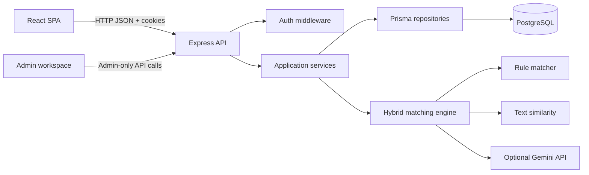
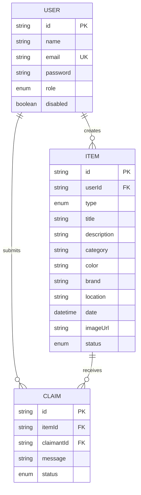

# LostLink

LostLink is a full-stack lost-and-found platform for creating item reports, discovering related lost or found reports, submitting claims, and moderating ownership decisions through an administrator workspace.

It combines deterministic matching with optional Gemini AI analysis. The local matcher provides predictable results even when AI is unavailable, while Gemini adds semantic reasoning for natural-language descriptions and competing claim statements.

<!-- IMAGE: hero-screenshot -->

## Contents

- [Product Overview](#product-overview)
- [Core Features](#core-features)
- [Technology Stack](#technology-stack)
- [Architecture](#architecture)
- [How the Application Works](#how-the-application-works)
- [Matching Engine](#matching-engine)
- [Claims and Admin Moderation](#claims-and-admin-moderation)
- [Data Model](#data-model)
- [API Overview](#api-overview)
- [Security](#security)
- [Project Structure](#project-structure)
- [Local Development](#local-development)
- [Environment Variables](#environment-variables)
- [Deployment](#deployment)
- [Demo Credentials](#demo-credentials)
- [Testing and Validation](#testing-and-validation)
- [Known Limitations](#known-limitations)
- [Image Placeholder Guide](#image-placeholder-guide)

## Product Overview

LostLink supports two sides of the recovery process:

- A person can report an item as lost or found.
- Users can browse active community reports.
- Users can submit a claim with a written explanation.
- The system finds reports of the opposite type that may describe the same physical item.
- Administrators can review all reports and claims.
- Administrators can approve one claimant and automatically reject competing pending claims.
- Administrators can optionally ask Gemini to rank competing claim statements.

The product is designed around human review. AI provides evidence and ranking, but it does not make the final ownership decision.

## Core Features

### Authentication

- Registration and login with email and password.
- Password hashing with bcrypt.
- JWT authentication in an HTTP-only cookie.
- Current-user session restoration.
- Logout and disabled-account handling.
- Protected routes for authenticated users.
- Admin-only authorization middleware.

### Reports

- Create LOST and FOUND reports.
- Store title, description, category, color, brand, location, date, and image URL.
- Browse reports with pagination.
- Filter by type, category, location, status, or search text.
- View full report details.
- Display image placeholders when external image URLs fail.

### Claims

- Submit a claim for any active report.
- Include a natural-language explanation of why the item may belong to the claimant.
- Prevent duplicate pending claims from the same claimant for the same item.
- View submitted claims.
- Allow administrators to approve or reject claims.

### Matching

- Compare LOST reports against FOUND reports and vice versa.
- Filter candidates using report type, active status, category, and a date window.
- Calculate structured field similarity.
- Calculate text similarity using normalized TF-IDF-style vectors and cosine similarity.
- Optionally enrich the top candidates with Gemini semantic analysis.
- Display score, confidence, local score, AI score, and AI explanation.

### Admin Workspace

- View user, report, and claim statistics.
- Filter reports between Found reports, Lost requests, and All reports.
- View claimant lists grouped by report.
- Approve one claimant or reject a claim manually.
- Automatically reject competing pending claims after approval.
- Run on-demand AI ranking for up to ten pending claims for one item.
- Enable or disable regular users.
- Delete regular users and their related records.
- Delete reports.
- Protect administrator accounts from deletion.

<!-- IMAGE: user-dashboard -->

<!-- IMAGE: report-form -->

<!-- IMAGE: item-details-and-claim-form -->

<!-- IMAGE: admin-workspace -->

## Technology Stack

### Frontend

- React 19
- React Router
- Vite
- CSS without a large UI framework
- React Context for authentication state

### Backend

- Node.js
- Express 5
- REST-style JSON API
- Zod request validation
- Cookie Parser
- CORS
- bcrypt
- JSON Web Tokens

### Data and Persistence

- PostgreSQL
- Prisma ORM
- Prisma migrations
- Relational foreign keys and cascading deletes

### AI and Matching

- Local rule-based scoring
- TF-IDF-style text similarity
- Optional Google Gemini API
- Gemini Flash model configured through environment variables

### Deployment

- Vercel for the combined frontend and API deployment
- Neon or another PostgreSQL provider for the database
- GitHub for source control

## Architecture



### Request Flow

1. The React client sends a request to `/api` using `fetch`.
2. Authentication cookies are sent with `credentials: "include"`.
3. Express parses the request and applies route middleware.
4. Authentication middleware validates the JWT and reloads the user from PostgreSQL.
5. Controllers validate input and delegate to services.
6. Services enforce business rules and call repositories or Prisma.
7. The API returns a consistent JSON response.
8. React updates the relevant page state.

### Ownership Boundaries

- Components own presentation and form interaction.
- Pages coordinate loading, navigation, and page-level state.
- Services wrap HTTP requests.
- Controllers translate HTTP requests into service calls.
- Services contain business rules.
- Repositories contain database access.
- Middleware contains cross-cutting authentication and authorization.
- Matching modules contain scoring and AI integration.

## How the Application Works

### Creating a Report

1. An authenticated user opens **Report an item**.
2. The form collects the report type and item details.
3. The client sends `POST /api/items`.
4. The server validates the data with Zod.
5. The report is associated with the authenticated user's ID.
6. The user is redirected to the new report details page.

### Finding Possible Matches

1. A user opens an item details page.
2. The page requests `GET /api/items/:id/matches`.
3. The server loads the source report.
4. Candidate reports are selected from the opposite report type.
5. Local structured and text scores are calculated.
6. Weak candidates are rejected.
7. The top five viable candidates may be sent to Gemini when AI is configured.
8. Results are returned in descending score order.
9. The UI displays possible matches and any AI explanation.

### Submitting a Claim

1. A user opens an active report.
2. The claim form accepts a statement of at least ten characters.
3. The client sends `POST /api/items/:itemId/claims`.
4. The server verifies that the item exists and is active.
5. The server prevents a duplicate pending claim from the same user.
6. The claim is stored as `PENDING`.

### Approving a Claim

When an admin approves a pending claim, the server executes a database transaction:

1. Selected claim becomes `APPROVED`.
2. Other pending claims for the same item become `REJECTED`.
3. The item becomes `RESOLVED`.

This prevents an item from ending with multiple approved claimants.

## Matching Engine

### Candidate Selection

The candidate selector:

- Excludes the source item.
- Selects the opposite type:
  - LOST -> FOUND
  - FOUND -> LOST
- Requires `ACTIVE` status.
- Uses a date range of fourteen days before and after the source date.
- First tries a case-insensitive category match.
- Falls back to type, status, and date if the category filter returns nothing.
- Limits the candidate set to fifty reports.

### Local Scoring

Structured fields and text similarity are combined as:

```text
localScore = structuredScore * 0.70 + textScore * 0.30
```

Candidates below `0.50` are rejected. Confidence labels are assigned as follows:

| Score | Confidence |
| ---: | --- |
| 0.85 or higher | HIGH |
| 0.65 to 0.849 | MEDIUM |
| Below 0.65 | LOW |

### AI Enrichment

Gemini is used only when all of these are configured:

- `AI_PROVIDER=gemini`
- `AI_API_KEY`
- `AI_MODEL`

The server sends sanitized fields rather than unrestricted database objects. Descriptions and text fields are length-limited before sending them externally.

Gemini returns:

```json
{
  "similarityScore": 0.87,
  "reason": "Both reports describe a black Nike bottle near the library."
}
```

The final score combines local and AI evidence:

```text
finalScore = localScore * 0.80 + aiScore * 0.20
```

If Gemini is unavailable, local results continue to work.

## Claims and Admin Moderation

### Admin Claim Ranking

Claim ranking is intentionally manual and on-demand:

- It is not executed when the admin dashboard loads.
- The admin clicks **Rank claims with AI** for a specific report.
- Pending claims for that report are batched into one Gemini request.
- A maximum of ten claims is analyzed.
- The response contains a rank, confidence, and reason for each claimant.
- The admin remains responsible for approving the final claimant.

This design limits free-tier API usage and prevents AI from becoming an automatic ownership authority.

## Data Model



### Enumerations

```text
Role:        USER | ADMIN
ItemType:    LOST | FOUND
ItemStatus:  ACTIVE | CLAIMED | RESOLVED
ClaimStatus: PENDING | APPROVED | REJECTED
```

## API Overview

All API routes are under `/api`.

### Authentication

| Method | Endpoint | Access | Purpose |
| --- | --- | --- | --- |
| POST | `/api/auth/register` | Public | Create an account |
| POST | `/api/auth/login` | Public | Start a session |
| POST | `/api/auth/logout` | Authenticated | Clear the session |
| GET | `/api/auth/me` | Authenticated | Load current user |

### Items

| Method | Endpoint | Access | Purpose |
| --- | --- | --- | --- |
| GET | `/api/items` | Public route, app-authenticated UI | List and filter reports |
| GET | `/api/items/:id` | Public route, app-authenticated UI | Get one report |
| POST | `/api/items` | Authenticated | Create a report |
| PUT | `/api/items/:id` | Authenticated | Update own report details |

### Claims

| Method | Endpoint | Access | Purpose |
| --- | --- | --- | --- |
| POST | `/api/items/:itemId/claims` | Authenticated | Submit a claim |
| GET | `/api/claims/mine` | Authenticated | View submitted claims |
| GET | `/api/items/:itemId/claims` | Report owner | View claims for own report |

### Matching

| Method | Endpoint | Access | Purpose |
| --- | --- | --- | --- |
| GET | `/api/items/:id/matches` | Authenticated | Calculate possible matches |

### Admin

| Method | Endpoint | Purpose |
| --- | --- | --- |
| GET | `/api/admin/dashboard` | Load admin statistics |
| GET | `/api/admin/users` | List users and counts |
| PATCH | `/api/admin/users/:id/disable` | Disable a user |
| PATCH | `/api/admin/users/:id/enable` | Enable a user |
| DELETE | `/api/admin/users/:id` | Delete a regular user |
| GET | `/api/admin/items` | List all reports |
| DELETE | `/api/admin/items/:id` | Delete a report |
| GET | `/api/admin/claims` | List all claims |
| POST | `/api/admin/items/:itemId/claim-ranking` | Rank pending claims with Gemini |
| PATCH | `/api/admin/claims/:id` | Approve or reject a claim |

## Security

- Passwords are hashed with bcrypt.
- JWTs are stored in HTTP-only cookies.
- Production cookies use secure and cross-site settings.
- Authentication reloads the user from the database on each protected request.
- Disabled users are rejected even if they still possess a valid token.
- Admin routes require both authentication and the `ADMIN` role.
- Zod validates request bodies and query parameters.
- Authentication routes use rate limiting.
- AI keys are server-side environment variables.
- AI payload fields are sanitized and length-limited.
- Admin approval is transactional.
- Admins cannot delete themselves or other administrators.

## Project Structure

```text
.
├── api/
│   └── [...path].js          # Vercel Express function entry
├── client/
│   ├── src/
│   │   ├── components/       # Reusable UI components
│   │   ├── context/          # Authentication context
│   │   ├── hooks/            # React hooks
│   │   ├── layouts/          # Shared application shell
│   │   ├── pages/            # Route-level screens
│   │   └── services/         # Frontend API clients
│   └── vite.config.js
├── prisma/
│   ├── schema.prisma         # Root seed/schema support
│   └── seed.js
├── server/
│   ├── prisma/
│   │   ├── migrations/
│   │   └── schema.prisma     # Active runtime schema
│   └── src/
│       ├── config/
│       ├── controllers/
│       ├── matching/
│       ├── middleware/
│       ├── repositories/
│       ├── routes/
│       ├── services/
│       ├── utils/
│       └── validators/
├── scripts/
├── tests/
├── vercel.json
└── package.json
```

## Local Development

### Prerequisites

- Node.js 18 or newer
- npm
- PostgreSQL or a Neon PostgreSQL database
- Optional Gemini API key

### Installation

```bash
git clone https://github.com/Nischal-Agrawal/Lost-Link.git
cd Lost-Link
npm install
```

Copy the environment template:

```powershell
Copy-Item .env.example .env
```

On macOS/Linux:

```bash
cp .env.example .env
```

Set at least:

```env
DATABASE_URL="your-postgresql-connection-string"
JWT_SECRET="a-random-secret-at-least-32-characters"
```

Generate Prisma Client and apply migrations:

```bash
npm run prisma:generate
npm run prisma:migrate
```

Optional seed:

```bash
npm run prisma:seed
```

Start the development environment:

```bash
npm run dev
```

The Vite client normally runs on `http://localhost:5173` and proxies `/api` to the Express server on port `5000`.

### Production Build

```bash
npm run build:client
npm start
```

The Express server serves the generated `client/dist` directory in production.

## Environment Variables

| Variable | Required | Description |
| --- | --- | --- |
| `DATABASE_URL` | Yes | PostgreSQL connection string |
| `JWT_SECRET` | Yes | At least 32-character JWT signing secret |
| `NODE_ENV` | Yes in production | `development`, `test`, or `production` |
| `PORT` | No | Express port, default `5000` |
| `CLIENT_URL` | No | Allowed frontend origin for CORS |
| `AI_PROVIDER` | No | Set to `gemini` to enable Gemini |
| `AI_API_KEY` | No | Server-side Gemini API key |
| `AI_MODEL` | No | Example: `gemini-2.5-flash` |

Never commit `.env`. Use hosting-provider environment variables in production.

## Deployment

The repository includes `vercel.json` for a combined frontend/API deployment:

- React output directory: `client/dist`
- Express function: `api/[...path].js`
- API prefix: `/api`
- SPA fallback: `index.html`
- Build command: Prisma generation followed by the Vite build

### Vercel Setup

1. Import the GitHub repository into Vercel.
2. Use the repository root as the project root.
3. Add `DATABASE_URL`, `JWT_SECRET`, and `NODE_ENV=production`.
4. Add Gemini variables if AI features are required.
5. Deploy and verify `/health` and `/api/auth/login`.

The frontend and API use the same domain, so the client can call relative `/api` URLs without a separate backend URL.

### Deployment Verification

```text
GET https://your-domain.vercel.app/health
GET https://your-domain.vercel.app/items
```

The login and registration pages are frontend routes. Their form submissions call:

```text
POST https://your-domain.vercel.app/api/auth/login
POST https://your-domain.vercel.app/api/auth/register
```

## Demo Credentials

The seed script provisions the demo administrator:

```text
Email:    admin@lostlink.local
Password: Admin@12345
```

Demo user accounts from the seed script:

```text
Email:    alex@lostlink.local
Password: User@12345

Email:    riya@lostlink.local
Password: User@12345
```

Change demo credentials before using a deployed environment.

## Testing and Validation

Available commands:

```bash
npm run build:client
npm run prisma:generate
npm test
```

Server syntax checks can be run with:

```bash
node --check server/src/server.js
node --check server/src/matching/matchingService.js
node --check server/src/matching/claimRanker.js
```

The project includes test-file placeholders under `tests/`. These should be expanded into real integration tests for authentication, authorization, item lifecycle, matching, claims, and admin moderation.

## Known Limitations

- The current image field accepts public image URLs rather than uploading binary files.
- Matching uses a bounded candidate set and simple local text similarity before AI enrichment.
- Gemini is optional and can fail or be rate-limited; local matching remains available.
- AI ranking is advisory and should not be treated as proof of ownership.
- Admin actions do not yet have a dedicated audit-log table.
- User deletion is destructive; production systems may prefer soft deletion.
- The test files need meaningful automated coverage.
- Production monitoring, structured logs, and alerting should be added for a larger deployment.

## Image Placeholder Guide

The README includes intentionally named placeholders so screenshots can be added without changing the documentation structure.

| Placeholder | Image to insert | Recommended content |
| --- | --- | --- |
| `hero-screenshot` | Product hero screenshot | A clean full-window screenshot showing the LostLink dashboard or items view. Blur or remove personal data. |
| `user-dashboard` | User dashboard screenshot | Logged-in user dashboard showing report actions and Lost/Found navigation. |
| `report-form` | Report creation screenshot | The create-report form with representative, non-sensitive example data. |
| `item-details-and-claim-form` | Item detail screenshot | An item detail page showing report metadata, claim form, and possible matches. |
| `admin-workspace` | Admin dashboard screenshot | Found-report filter, claimant list, manual approval buttons, and the AI ranking action. Hide emails or use seeded demo accounts. |

### Suggested Image Paths

When screenshots are available, store them in:

```text
docs/images/hero-screenshot.png
docs/images/user-dashboard.png
docs/images/report-form.png
docs/images/item-details-and-claim-form.png
docs/images/admin-workspace.png
```

Then replace each marker with normal Markdown image syntax, for example:

```markdown

```

## Interview Summary

The strongest concise summary is:

> LostLink is a React and Express lost-and-found platform backed by PostgreSQL and Prisma. It supports authenticated reports, claims, admin moderation, and hybrid matching. The matching engine first uses deterministic structured and text similarity, then optionally asks Gemini to enrich the top candidates. Claim approval is transactional, and admin AI ranking is batched, bounded, and explicitly triggered so the system remains cost-aware and human-controlled.
